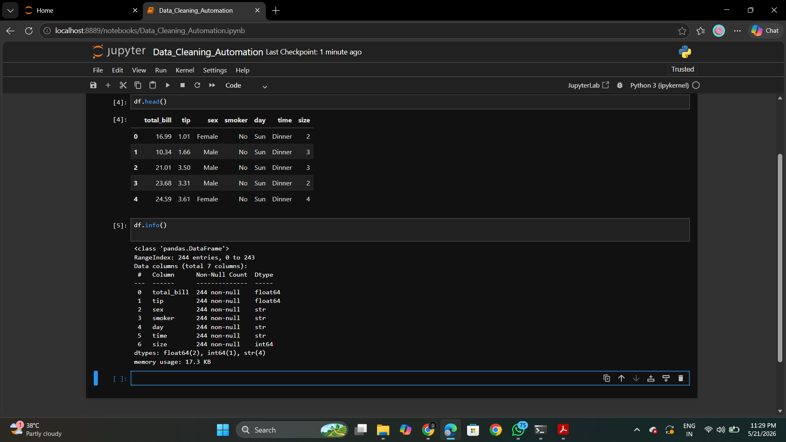
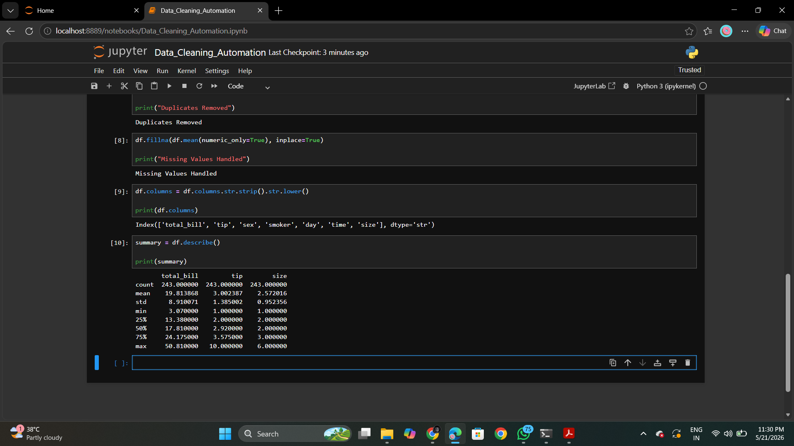
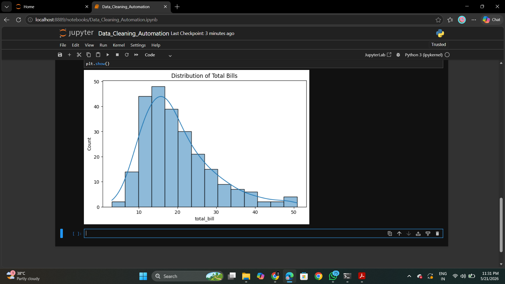
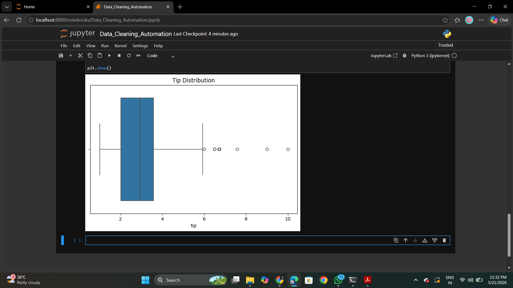

# Data Cleaning & Reporting Automation

## Project Overview

This project automates data cleaning and reporting workflows using Python.

The workflow includes:
- handling missing values
- removing duplicates
- cleaning column names
- generating summary reports
- creating automated visualizations
- exporting cleaned datasets

The project demonstrates practical data preprocessing and reporting automation techniques used in real-world analytics workflows.

---

## Technologies Used

- Python
- Jupyter Notebook
- Pandas
- Matplotlib
- Seaborn
- OpenPyXL

---

## Features

- Automated data cleaning
- Missing value handling
- Duplicate removal
- Data preprocessing
- Automated summary generation
- Excel report generation
- Data visualization

---

## Dataset

- Sales Dataset

Columns include:
- total_bill
- tip
- sex
- smoker
- day
- time
- size

---

## Workflow

1. Load Dataset
2. Check Dataset Structure
3. Handle Missing Values
4. Remove Duplicates
5. Standardize Column Names
6. Generate Summary Statistics
7. Create Visual Reports
8. Export Cleaned Dataset
9. Generate Excel Summary Report

---

## Visualizations

### Dataset Information



---

### Summary Statistics Report



---

### Total Bill Distribution



---

### Tip Distribution



---

## Outputs Generated

- Cleaned CSV Dataset
- Excel Summary Report
- Visual Analytics Charts

---

## Repository Structure

```bash
data-cleaning-automation-project
│
├── dataset
├── notebook
├── output
├── screenshots
├── report
├── README.md
├── requirements.txt
└── LICENSE
```

---

## Author

Tanishka Rupeshkumar Bellale

B.Tech Computer Engineering  
JSPM RSCOE

---

## License

This project is licensed under the MIT License.
